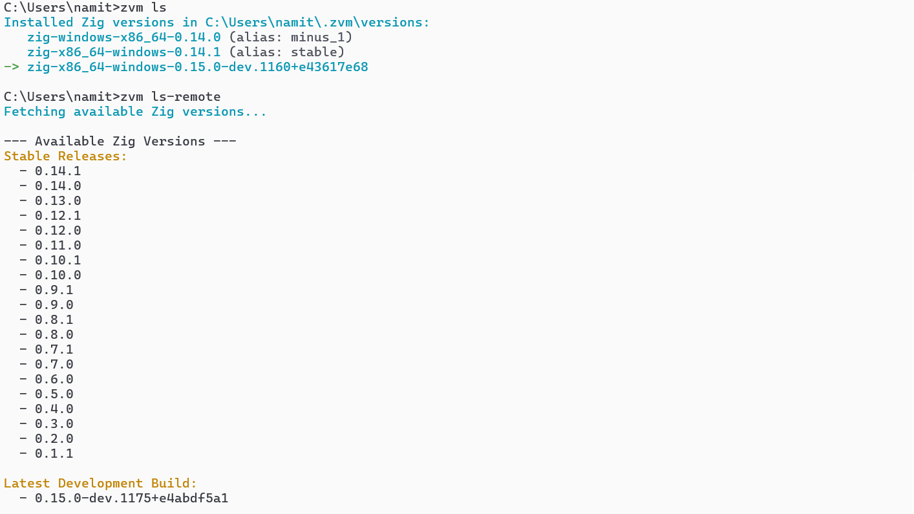

# zvm - The Zig Version Manager (JavaScript Edition)


A lightweight, cross-platform solution for managing multiple Zig compiler versions

## Why zvm.js?

Unlike other Zig version managers written in Go or Zig, this JavaScript implementation offers:

* **🛠️ Single-file implementation** - Pure JavaScript with no dependencies beyond `tar`
* **🌐 Cross-platform support** - Works on Linux, macOS, and Windows (PowerShell & CMD)
* **⚡ Runtime agnostic** - Runs with Node.js, Deno, or Bun
* **🏷️ Aliasing** - Assign custom names to installed versions
* **📁 Project-specific versions** - Auto-detects `.zig-version` files
* **🔁 Mirror support** - Downloads from fastest available community mirror
* **🎨 Colorized output** - Intuitive terminal interface
* **🔧 Atomic operations** - Safe installation with retry logic

## Prerequisites

1.  **A JavaScript Runtime:** You need one of the following installed:
    * [Node.js](https://nodejs.org/) (v16+)
    * [Bun](https://bun.sh/)
    * [Deno](https://deno.land/)

2.  **`tar` command:** The script uses the system's `tar` command to extract archives.
    * **Linux/macOS:** `tar` is pre-installed.
    * **Windows:** `tar` is included with [Git for Windows](https://git-scm.com/download/win). Ensure Git's `bin` directory is in your system `PATH`.

---

## Installation

1.  **Download `zvm.js`**

    Download the `zvm.js` script from this repository.

2.  **Place it in your PATH**

    Move the script to a directory that is part of your system's `PATH` and make it executable.

    **For Linux & macOS:**

    ```bash
    # Download zvm
    curl -fsSL https://raw.githubusercontent.com/namitkewat/zvm.js/refs/heads/main/zvm.js > /usr/local/bin/zvm
    chmod +x /usr/local/bin/zvm

    # Initialize zvm
    zvm init

    # Add to your shell profile (shown after init)
    source ~/.zvm/zvm.sh
    ```

    **For Windows:**

    * Create a directory like `C:\bin`.
    * Add this directory to your system's `PATH` environment variable.
    * Move `zvm.js` into `C:\bin` and rename it to `zvm.js`.
    * Create a batch file named `zvm.cmd` in the same directory with the following content:
        ```batch
        @echo off
        node "%~dp0\zvm.js" %*
        ```

3.  **Initialize `zvm`**

    Run the `init` command to generate the necessary shell configuration scripts.

    ```bash
    zvm init
    ```

    This will display platform-specific instructions. Follow them to complete the setup for your shell (e.g., adding a `source` command to your `~/.bashrc` or PowerShell profile).

4.  **Restart Your Shell**

    Close and reopen your terminal or run the provided `source` command to apply the changes. `zvm` is now ready to use!

---

## Quick Start

```bash
# Install latest stable version
zvm install 0.14.1 --alias stable

# Use in current shell
zvm use stable

# Verify installation
zig version

# Install development build
zvm install 0.15.0-dev.1175+e4abdf5a1 --alias dev

# Switch between versions
zvm use dev
```

## Command Reference

| Command | Description | Example |
|---------|-------------|---------|
| `zvm init` | Setup shell integration | `zvm init` |
| `zvm install` | Install Zig version | `zvm install 0.14.1 --alias stable` |
| `zvm use` | Activate version | `zvm use stable` |
| `zvm list` | Show installed versions | `zvm list` |
| `zvm list-remote` | Show available versions | `zvm list-remote` |
| `zvm alias` | Manage version aliases | `zvm alias dev 0.15.0-dev.1175` |
| `zvm current` | Show active version | `zvm current` |
| `zvm uninstall` | Remove version | `zvm uninstall 0.13.0` |
| `zvm deactivate` | Deactivate current version | `zvm deactivate` |


## Docker Integration

Sample Dockerfile

```Dockerfile
# Fedora-based development container
FROM public.ecr.aws/docker/library/fedora:43

# Install dependencies
RUN dnf update -y && \
    dnf install -y git tar unzip nodejs && \
    dnf clean all

# Install zvm
ADD https://raw.githubusercontent.com/namitkewat/zvm.js/refs/heads/main/zvm.js /usr/local/bin/zvm
RUN chmod +x /usr/local/bin/zvm

# Set up environment
RUN zvm init
ENV PATH="/root/.zvm/shims/active:${PATH}"

# Install Zig versions
ARG ZIG_STABLE=0.14.1
ARG ZIG_DEV=0.15.0-dev.1160+e43617e68
RUN zvm install $ZIG_STABLE --alias stable
RUN zvm install $ZIG_DEV --alias dev
RUN zvm use stable

# Verify installation
RUN zig version

# Default working directory
WORKDIR /app
```


## Project Configuration

Add a `.zig-version` file to your project root:

```bash
# .zig-version
0.14.1
```

zvm will automatically use this version when you enter the project directory.

## Performance Tips

1. **Mirror Prioritization**: zvm tests community mirrors for fastest download
2. **Atomic Installs**: Uses temp directories and atomic renames
3. **Alias Caching**: Aliases are stored for quick version switching
4. **Batch Operations**: Install multiple versions in Docker builds

## Troubleshooting

**Windows Anti-virus Slowdown**:
```bash
# If you see rename retries during install:
⚠️  Rename failed, retrying in 300ms... (1/5)
```
This is normal - zvm.js automatically retries operations blocked by real-time scanning.

**Missing `tar` on Windows**:
```bash
Install Git for Windows and ensure its bin directory is in PATH
```

## Screenshots

### Gallery of ZVM.js in Action

<div align="center">
  <table>
    <tr>
      <td align="center">
        
        <p><strong>Version Management</strong><br>Listing and installing Zig versions</p>
      </td>
      <td align="center">
        
        <p><strong>Available Versions</strong><br>Browsing installable Zig versions</p>
      </td>
      <td align="center">
        
        <p><strong>Alias Management</strong><br>Using aliases for version control</p>
      </td>
    </tr>
  </table>
</div>

## License

MIT License - See [LICENSE](LICENSE) for details
